# XBoard CF

XBoard CF 是基于 Cloudflare Workers、D1、KV、Queues、Durable Objects 和 Static Assets 重写的 XBoard。项目保留官方后台 WebUI、用户 API、订阅接口、节点协议、支付、礼品卡、订单分配、邮件和 Telegram 等功能，不需要部署 Laravel、PHP、MySQL 或 Redis。

> 固定的 Cloudflare-native 支付 Provider、支付回调和订单结算已经实现；需要真实出金的佣金提现仍暂缓。余额、套餐、流量、邮件及其他业务均使用真实数据处理。

## 主要功能

- 官方 XBoard 后台 WebUI，入口为 `/admin`
- 用户、套餐、权限组、节点、服务器、路由、公告、知识库和工单管理
- 系统设置、订阅设置、订阅模板和邮件模板管理
- Maileroo/Brevo 邮件发送、测试邮件、模板测试、批量用户邮件和提醒邮件队列
- 用户 API 与第三方用户前端兼容接口
- Base64、Clash、Clash Meta、Surge、Shadowrocket、Quantumult X 和 Loon 订阅输出
- UniProxy、ShadowsocksTidalab、TrojanTidalab 和 V2 节点接口
- Xboard-Node 单节点模式、机器模式和 WebSocket 热同步
- 节点在线状态、机器负载、负载历史折线图和网络速率展示
- D1 持久化业务数据，KV 缓存临时状态
- Queue 异步处理流量，Cron Worker 执行周期任务
- 后台联合导入原版 SQLite3 与 Redis RDB，平滑切换到 D1 + KV
- 导出完整 XBoard-CF 或原版兼容 SQLite3，并支持迁移失败后按快照一键还原
- 后台全局搜索仅展示当前可用功能，并可直接打开数据迁移

## 后台入口

站点根路径只返回：

```text
200
```

后台登录页：

```text
https://你的域名/admin
```

后台内部使用 Hash 路由，例如：

```text
/admin#/server/machine
/admin#/server/manage
/admin#/user/manage
```

后台路径可在“系统管理 -> 系统配置 -> 安全设置”中修改。修改后应使用新的安全路径访问后台；菜单中的“数据迁移”和全局搜索结果会自动使用当前路径。

主题配置和任意 PHP 插件管理不兼容 Cloudflare-native 运行时，因此对应菜单及全局搜索结果仍隐藏。支付配置已使用固定的原生 Provider Registry 恢复，后台“支付配置”菜单可直接管理 AlipayF2F、BTCPay、Coinbase Commerce、Coinbase Business、CoinPayments、EPay、MGate 和 Stripe。

### 默认超级管理员

```text
邮箱：admin@admin.com
密码：adminadmin
```

首次登录后请立即修改默认密码。

## Worker 架构

每个 Worker 都是独立部署根目录：

| Worker | 根目录 | 职责 |
| --- | --- | --- |
| `xboard-edge` | `workers/xboard-edge` | 后台 WebUI、后台 API、用户 API、订阅校验与格式生成、节点接口代理 |
| `xboard-server` | `workers/xboard-server` | 节点 HTTP、机器模式、状态上报和 WebSocket |
| `xboard-jobs` | `workers/xboard-jobs` | Queue 消费、权威流量写入、Outbox、TrafficStatsHub、通知发送和定时维护 |

Worker 之间没有依赖仓库根目录的共享运行时代码，因此 Cloudflare 可以直接把每个目录设置为独立的构建根目录。

## Cloudflare 资源

以下资源均由首次 GitHub Actions 自动创建或复用：

| 资源 | 名称或绑定 | 用途 |
| --- | --- | --- |
| D1 | `xboard-db` / `XBOARD_DB` | 用户、套餐、节点、订单、设置、流量和统计等正式业务数据；新建数据库默认位于 APAC 并开启读取复制 |
| KV | `xboard-kv` / `XBOARD_KV` | Session、验证码、限流、缓存和版本标记 |
| Queue | `traffic-events` | 节点流量异步入库，由 `xboard-jobs` 消费 |
| Queue | `notification-events` | 邮件与 Telegram 通知任务，由 `xboard-jobs` 按消息类型消费 |
| Queue | `traffic-events-dlq` | 流量任务连续失败 5 次后的死信队列 |
| Queue | `notification-events-dlq` | 通知任务连续失败 5 次后的死信队列 |
| Durable Object | `NodeHub` / `NODE_HUB` | 节点和机器 WebSocket 连接、同步事件与休眠连接管理 |
| Durable Object | `StatusHub` / `STATUS_HUB` | 全局节点与机器实时状态、设备状态和最近 24 小时机器负载趋势 |
| Durable Object | `TrafficStatsHub` / `TRAFFIC_STATS_HUB` | 全局流量批次去重、16 分片日聚合和每小时绝对值物化 |
| Static Assets | `ASSETS` | `xboard-edge` 托管后台 WebUI、语言包和静态文件 |
| Service Binding | `XBOARD_SERVER` | `xboard-edge`、`xboard-jobs` 调用 `xboard-server` |
| Service Binding | `XBOARD_JOBS` | `xboard-edge` 请求 `xboard-jobs` 补投 Outbox、物化和重置统计状态 |
| Worker Secret | `INTERNAL_SYNC_TOKEN` | 三个 Worker 之间的内部鉴权；可由仓库 Secret `XBOARD_INTERNAL_TOKEN` 稳定同步，未配置时使用 D1 兼容密钥，绝不与节点 `server_token` 共用。Secret 滚动发布期间内部请求会同时携带 D1 兼容凭据，部分 Worker 尚未更新也不会中断通信 |
| Queue Producer | `TRAFFIC_EVENTS` | `xboard-server` 写入 `traffic-events` |
| Queue Producer | `NOTIFICATION_EVENTS` | `xboard-edge`、`xboard-jobs` 写入邮件或 Telegram 通知事件 |
| Cron Trigger | `* * * * *` | `xboard-jobs` 每分钟调度周期检查、统计、提醒和清理任务 |

三个业务 Worker 绑定同一个 D1 和 KV。D1 是正式业务数据的唯一权威来源。流量事件先原子写入用户、服务器累计量和 Outbox，再由 `TrafficStatsHub` 聚合并按小时物化原版统计表；流量排行直接查询 D1，机器负载趋势直接读取 `StatusHub` 最近 24 小时的五分钟采样。

所有业务 D1 请求都通过 Sessions API 执行。后台、用户 API、节点协议、WebSocket 事件、Queue、Cron 和迁移从 `first-primary` 开始。`xboard-edge` 内部订阅模块的鉴权与生成，以及 `GET /api/v1/guest/plan/fetch`、`GET /api/v1/guest/comm/config` 两个匿名展示接口使用独立的 `first-unconstrained` Session。合并部署不会让订阅继承后台的主库 Session；订阅读取仍优先分散到可用副本，代价是封禁、Token、流量、权限组和节点配置变更可能在副本追上主库前短暂延迟生效。数据库未开启读取复制时 Sessions API 会自动使用主实例，不需要两套代码，也不会导致接口异常。读取复制用于降低远距离读取延迟和扩展读取吞吐量，不会减少 D1 的 `rows_read` 或 `rows_written` 计费。

```mermaid
flowchart TB
  subgraph Clients["访问层"]
    Admin["后台浏览器<br/>/<secure_path>#/*"]
    UserUI["第三方用户前端<br/>/api/v1/* 与 /api/v2/user/*"]
    SubClient["订阅客户端<br/>Clash / Sing-box / Surge / Loon 等"]
    XNode["原版 Xboard-Node<br/>HTTP / WebSocket / 机器模式"]
  end

  subgraph Entry["主入口与静态资源"]
    Edge["xboard-edge<br/>后台 WebUI + 后台 API + 用户 API<br/>订阅生成 / 认证 / 支付 / 设置 / 迁移 / 节点协议代理"]
    Assets["Cloudflare Static Assets<br/>官方后台构建产物 / 语言包 / 图片"]
  end

  Admin -->|"HTTPS"| Edge
  UserUI -->|"HTTPS"| Edge
  SubClient -->|"订阅 URL"| Edge
  XNode -->|"面板主域名 HTTP / WS"| Edge
  Edge -->|"ASSETS binding"| Assets

  subgraph Workers["独立 Worker 层"]
    Server["xboard-server<br/>V1 / V2 / Tidalab / 机器接口<br/>流量上报 / WebSocket / 热同步"]
    Jobs["xboard-jobs<br/>Queue consumer + 每分钟单 Trigger<br/>原子幂等 / 聚合 / 通知 / 周期维护"]
  end

  Edge -->|"XBOARD_SERVER<br/>Service Binding"| Server
  Jobs -->|"XBOARD_SERVER<br/>内部同步"| Server
  Edge -->|"XBOARD_JOBS<br/>按需物化"| Jobs

  subgraph Realtime["实时状态与连接协调"]
    NodeHub["NodeHub Durable Object<br/>按 node:{id} / machine:{id} 分片<br/>WebSocket Hibernation / sync.*"]
    StatusHub["StatusHub Durable Object<br/>单个 global 实例<br/>实时状态 / 设备 / 24 小时负载"]
    TrafficStatsHub["TrafficStatsHub Durable Object<br/>单个 global 实例<br/>批次去重 / 16 分片日聚合"]
  end

  Server <-->|"连接与配置热同步"| NodeHub
  Server <-->|"心跳 / Metrics / 设备状态"| StatusHub
  Jobs -->|"Outbox 聚合批次"| TrafficStatsHub

  subgraph Queues["异步任务与失败隔离"]
    TrafficQ["traffic-events<br/>max retries: 5"]
    NotificationQ["notification-events<br/>邮件 + Telegram / max retries: 5"]
    TrafficDLQ["traffic-events-dlq"]
    NotificationDLQ["notification-events-dlq"]
  end

  Server -->|"TRAFFIC_EVENTS"| TrafficQ
  Edge -->|"NOTIFICATION_EVENTS"| NotificationQ
  Jobs -->|"NOTIFICATION_EVENTS"| NotificationQ
  TrafficQ --> Jobs
  NotificationQ --> Jobs
  TrafficQ -. "连续失败" .-> TrafficDLQ
  NotificationQ -. "连续失败" .-> NotificationDLQ

  subgraph Data["数据与缓存层"]
    Memory["Worker isolate 内存缓存<br/>设置与读取模型热缓存<br/>同键并发请求合并"]
    CacheAPI["Cloudflare Cache API<br/>统计 / 配置 / 内容 / 订阅<br/>StatusHub 读取结果"]
    KV["KV: xboard-kv<br/>Session / 验证码 / 限流<br/>版本号 / 设置快照"]
    D1["D1: xboard-db<br/>用户 / 套餐 / 节点 / 订单 / 余额<br/>设置 / 最终流量 / 统计 / 审计"]
    PaymentTx["v2_payment_transactions<br/>Provider 会话 / 事件幂等<br/>不保存完整 webhook"]
    Pending["v2_traffic_pending_check<br/>仅保存真正需要复查的用户"]
    Outbox["v2_traffic_stats_outbox<br/>每个聚合批次最多一行<br/>成功投递 DO 后删除"]
  end

  Edge -. "内存 -> KV -> D1" .-> Memory
  Server -. "内存 -> KV -> D1" .-> Memory
  Jobs -. "内存 -> KV -> D1" .-> Memory
  Memory -. "版本快照；失败时跳过" .-> KV
  Edge -. "统计、配置、内容与订阅" .-> CacheAPI
  Server -. "节点配置与用户快照" .-> CacheAPI
  CacheAPI -. "未命中、过期或不可用" .-> D1
  CacheAPI -. "状态缓存未命中" .-> StatusHub
  KV -. "缓存未命中或不可用" .-> D1
  Edge <-->|"正式业务读写"| D1
  Edge -->|"原子订单结算"| PaymentTx
  PaymentTx --> D1
  Server <-->|"配置读取 / 流量事件来源"| D1
  Jobs -->|"权威累计 / 幂等 / Outbox"| D1
  Jobs <-->|"周期业务检查与清理"| D1
  Jobs --> Pending
  Pending --> Jobs
  Jobs --> Outbox
  Outbox --> TrafficStatsHub
  TrafficStatsHub -->|"每小时绝对值覆盖 v2_stat*"| D1
  Edge -->|"排行与统计"| D1
  Edge -->|"最近 24 小时负载趋势"| StatusHub

  subgraph External["外部 HTTPS 服务"]
    MailProvider["Maileroo / Brevo API"]
    TelegramAPI["Telegram Bot API"]
    PaymentProviders["支付 Provider<br/>Alipay / BTCPay / Coinbase<br/>CoinPayments / EPay / MGate / Stripe"]
  end

  Jobs -->|"发送邮件"| MailProvider
  Jobs -->|"发送异步通知"| TelegramAPI
  Edge -->|"Webhook 设置 / Bot 操作"| TelegramAPI
  Edge <-->|"托管结账 / 签名回调 / 状态复核"| PaymentProviders

  subgraph Delivery["首次部署与后续自动部署"]
    GitHub["GitHub 仓库<br/>master"]
    Bootstrap["手动 GitHub Action<br/>首次创建资源、初始化 D1、部署三个 Worker"]
    Builds["Cloudflare Workers Builds<br/>三个 Worker 分别绑定各自根目录"]
    CFResources["Cloudflare 账号资源<br/>D1 / KV / Queues / DO / Workers"]
  end

  GitHub -->|"首次手动运行"| Bootstrap
  Bootstrap --> CFResources
  Bootstrap -->|"仅在部署进程中注入资源绑定"| CFResources
  GitHub -->|"后续 push"| Builds
  Builds -->|"按根目录测试并部署"| CFResources
```



图中实线表示正常请求、内部调用或持久化数据流；虚线表示缓存回源、失败转移或非主路径。三个 Worker 都从同一仓库部署，但构建根目录和 Cloudflare Worker 服务彼此独立；订阅是 `xboard-edge` 内部模块，定时维护则作为 `xboard-jobs` 内部模块运行。

### 存储与流量写入

- **D1**：用户、套餐、权限组、节点配置、订单、余额、最终流量、统计和系统设置的权威数据。业务请求默认使用 `first-primary` Session，确保同一请求内顺序一致且能够读取自己的写入；Edge 内部订阅模块和两个经过审计的匿名展示接口从可用读取副本开始。
- **KV**：Session、验证码、限流、版本号和可重建缓存；不是 Redis 数据的逐键永久替代品。
- **Worker isolate 内存缓存**：每个 Worker 实例独立保存设置和读取模型热缓存，并用 single-flight 合并同一缓存键的并发回源。实例回收后缓存自然消失，不能保存权威数据。
- **Cloudflare Cache API**：三个 Worker 均启用运行时 Cache API。Edge 和 Server 用它保存后台统计、节点与机器基础快照、套餐、权限组、路由、公告、知识库、节点配置、节点用户列表及 StatusHub 读取结果；Jobs 当前只启用能力，不缓存 Queue、Cron、流量幂等或权威写入结果。缓存键包含现有版本号，后台修改后自动切换到新键；Cache API 不可用、内容过期或读取失败时直接回到 D1/StatusHub。订阅正文及其生成所需的用户、节点、模板和设置不使用内存、KV 或 Cache API 缓存，每次通过 `first-unconstrained` Session 从 D1 可用读取副本重新生成。
- **NodeHub**：维护节点或机器的 WebSocket 连接及配置、用户热同步。
- **StatusHub**：保存高频在线状态、设备状态和机器心跳；运行状态最多每 60 秒持久化一次，设备成员最多每 240 秒持久化一次。机器负载每 300 秒追加一个样本，并持续裁剪为最近 24 小时、最多 1440 点。
- **TrafficStatsHub**：单个全局 DO 按 `batch_id` 去重，将用户日状态按 `user_id % 16` 分片，服务器日状态单独聚合；每小时把绝对累计值覆盖回原版 `v2_stat*` 表，不保存分析副本。
- **Queues**：把高频流量、邮件和 Telegram 任务与 HTTP 请求解耦；连续失败超过重试上限后进入对应 DLQ。

流量事件使用稳定 `event_id` 去重，用户与服务器权威累计、事件幂等、待检查用户和一行 Outbox 在同一个 D1 原子批次内提交。`batch_id` 由排序后的已接受事件 ID 生成，Queue 和 Outbox 重试都不会重复计费或重复聚合。Cloudflare Queue 最多聚合 100 条消息，Jobs Worker 内部按 25 条子批次处理；节点上报按最多 250 个用户拆分事件。同一子批次只产生一行 Outbox，DO 确认后删除；失败则由每分钟 Cron 补投。只有已经达到流量阈值、真正需要复查的用户才写入 `v2_traffic_pending_check`。

原版 `v2_stat_user`、`v2_stat_server` 和 `v2_stat` 继续保留。TrafficStatsHub 使用绝对值 `ON CONFLICT ... DO UPDATE SET value = excluded.value` 物化，重复执行不会叠加；`v2_stat` 只覆盖 `transfer_used`，不会改写收入、订单、佣金或注册统计。SQLite 导出前会强制补投 Outbox 和物化，失败时导出中断；完整迁移、覆盖导入和回滚会清空 Outbox 与 DO 状态，再从切换后的原版统计表建立当日基线。

后台概览缓存 15–30 秒，Queue 统计和流量排行缓存 60 秒，历史排行与内容快照缓存 5–10 分钟；机器负载趋势缓存 60 秒。节点配置按 `servers_version` 缓存 300 秒，节点用户列表仅缓存 30 秒，认证、流量上报、设备报告、余额和限额判断从不缓存。Cron 只有一个每分钟 Trigger，并使用一个共享 D1 所有权锁；健康心跳 `schedule:last_check_at` 最多每 300 秒刷新一次。WebSocket 在线路由 KV 只在连接变化、断开或持续在线满 6 小时时刷新，不随每次 `pong` 写入。

## 邮件服务

邮件不再使用 SMTP，`xboard-edge` 将带有 `type: "mail"` 的任务写入统一的 `notification-events`，`xboard-jobs` 根据后台选择通过 Maileroo 或 Brevo 的 HTTPS API 发送。Telegram 通知使用同一 Queue，但以 `type: "telegram"` 区分，业务处理和幂等记录仍相互独立。后台“邮件设置”中的字段含义为：

```text
邮件服务商：Maileroo 或 Brevo，默认 Maileroo
发件人名称：邮件中显示的名称
API Key：所选服务商创建的 API Key
发件人地址：已在所选服务商验证的域名邮箱
```

生产环境也可以把 API Key 配置为 `xboard-jobs` 的 Worker Secret，Secret 会覆盖后台保存值：

```bash
cd workers/xboard-jobs
npx wrangler secret put MAILEROO_API_KEY
# 或
npx wrangler secret put BREVO_API_KEY
```

Maileroo 免费层通常为每月 3,000 封，Brevo 免费层通常为每天 300 封，实际额度以服务商最新政策为准。邮件 Queue 使用稳定事件 ID 做幂等处理。

## 支付

后台“系统管理 -> 支付配置”提供八个固定的 Cloudflare-native Provider：

```text
AlipayF2F
BTCPay
Coinbase
CoinbaseBusiness
CoinPayments
EPay
MGate
Stripe
```

`Coinbase` 用于兼容旧 Coinbase Commerce Charge 配置，`CoinbaseBusiness` 使用当前 Checkout API，并可在同一配置项中明确选择生产或沙盒环境。Stripe 使用托管式 Checkout Sessions，固定 `mode=payment`，不收集或保存卡号；套餐有效期仍由 XBoard 订单系统管理。Creem 的固定 Product 定价模型与 XBoard 动态实付金额、优惠券和余额抵扣不匹配，因此没有加入。

所有回调都必须通过签名、订单号、唯一渠道 UUID、支付会话、金额、币种和成功状态校验。合法回调还会向 Provider 二次查询最终状态（适用的渠道），随后通过同一个 D1 原子结算服务开通套餐。重复、并发或重放回调不会重复开通；迁移数据中若缺少渠道 UUID 或出现重复 UUID，相关渠道会保留但停用，回调也会拒绝猜测其中任意一个。D1 批次失败不会留下 `status=1` 的半完成订单。内部 `v2_payment_transactions` 只保存必要的幂等元数据，不保存完整 webhook 正文。

仍有效的托管支付会话会在重复点击结账时复用。Provider 明确给出到期时间后，过期会话不会使用同一幂等键盲目重建；用户需要取消当前待支付订单并重新下单，以生成新的订单号和支付会话，避免重复扣款或反复跳回失效页面。

支付配置保存在 `v2_payment.config`，管理员读取配置和 SQLite 完整导出均会包含私钥、API Key 与 Webhook Secret。管理员审计日志会递归脱敏这些字段，但导出的数据库不会脱敏，必须作为敏感凭据安全保管。渠道一旦被订单或支付事务引用，其 Provider、密钥与 Webhook 配置将被冻结；需要轮换凭据时应停用旧渠道并新建渠道，使已创建支付会话的旧回调仍可安全验签。自定义网关和通知域名只接受公开 HTTPS 地址；Provider 请求有超时、响应大小和返回结构限制。

Stripe 应在 Dashboard 为当前支付渠道的通知 URL 创建 webhook endpoint，并订阅：

```text
checkout.session.completed
checkout.session.async_payment_succeeded
```

Coinbase Business 的生产与沙盒 checkout 使用不同 API 路径；沙盒 webhook subscription 还需要 Coinbase 要求的 `sandbox: true` 标签。其他渠道直接把后台显示的 `notify_url` 配置到对应商户后台。退款仍由支付服务商后台处理，本项目不自动修改已开通套餐。

为降低 Cloudflare 免费额度下的 D1/KV 读写压力，新部署默认将节点配置拉取与流量推送间隔设为 300 秒。该值是 Cloudflare 版本有意采用的资源优化默认值，可在后台系统设置中调整；其他新装默认值（例如 1 小时试用时长）继续对齐原版。

## 首次部署与仓库自动部署

最终部署结构是三个 Worker 分别连接同一个 GitHub 仓库，由 Cloudflare Workers Builds 监听 `master`。每个 Worker 使用自己的根目录，后续 push 不依赖 GitHub Actions 执行 `wrangler deploy`。订阅生成已作为独立模块合并到 `xboard-edge`，定时任务已合并到 `xboard-jobs`。

开始前必须先让 Cloudflare 账号与 GitHub 账号建立授权关系。打开官方 [Cloudflare Workers & Pages GitHub App](https://github.com/apps/cloudflare-workers-and-pages)，选择 `Install` 或 `Configure`，授权当前 GitHub 账号，并允许它访问准备部署 XBoard 的仓库。Cloudflare 之后才能读取仓库并监听 push。

1. 打开 [Cloudflare API Tokens](https://dash.cloudflare.com/profile/api-tokens)，以 `Edit Cloudflare Workers` 模板创建 API Token，并补充 D1、Workers KV Storage 和 Queues 的编辑权限。新 Cloudflare 账号还应至少打开一次 [Workers & Pages](https://dash.cloudflare.com/?to=/:account/workers-and-pages)，让 Cloudflare 初始化账号的 `workers.dev` 子域名。

   

2. Fork 本仓库到自己的 GitHub 账号，或使用本仓库作为部署源。部署仓库必须包含完整项目，并保留三个 Worker 根目录；生产分支使用 `master`。

   

3. 在部署仓库进入 `Settings -> Secrets and variables -> Actions`，新建名为 `CLOUDFLARE_API_TOKEN` 的 Repository secret，值为第一步创建的 Token。Token 由 GitHub Secrets 保存，不要写入代码或公开日志。

   

首次部署使用仓库内只允许手动触发的 `.github/workflows/deploy.yml`：

```text
CLOUDFLARE_API_TOKEN
```

然后打开 `Actions -> Bootstrap XBoard on Cloudflare -> Run workflow`。workflow 会自动识别 Token 所属账号，创建或复用 `xboard-db`、`xboard-kv`、两个业务 Queue 及对应的两个死信队列，只在本次 Action 的临时 checkout 中注入账号、D1 和 KV 绑定，再自动执行 D1 schema 与 seed，创建 Durable Objects、Cron Trigger、Static Assets 和 Service Bindings，并按依赖顺序创建或更新三个 Worker。资源 ID 不会提交或推送到仓库。新建的 `xboard-db` 使用 `APAC` 位置提示，并自动尝试开启 D1 Read Replication；开启失败只会在 Action 中显示警告，不会阻断部署。已存在的同名数据库会原样复用，不修改主库位置或读取复制开关。它只配置了 `workflow_dispatch`，不会在每次 push 时运行。

仓库中的 `wrangler.toml` 只保留公开的 Worker、绑定和资源名称，不包含 Cloudflare Account ID、D1 Database ID 或 KV Namespace ID。首次部署时 Action 使用临时绑定完成部署。后续 Workers Builds 通过 `npm run deploy` 启用 Wrangler 资源重连，从已部署 Worker 的同名绑定复用现有 D1/KV，不会创建新的业务库，也不会把租户 ID 写回 Git。

API Token 至少需要该账号下 Workers Scripts、D1、Workers KV Storage、Queues 和 Account Settings 的读取/编辑权限。若 Token 可访问多个账号，workflow 使用 Cloudflare API 返回的第一个账号。

### 必须完成的一次 GitHub 授权

前置步骤中的 GitHub App 授权必须在配置 Builds 前完成。`CLOUDFLARE_API_TOKEN` 只能操作 Cloudflare 账号，不能替 GitHub 仓库所有者批准仓库访问；Cloudflare 目前也没有公开的 Wrangler 命令或 REST API 用于创建 Workers Builds 的 Git 仓库连接。这是 GitHub 的安全授权边界，workflow 无法绕过。

授权完成后，在 Cloudflare 中依次打开每个已创建的 Worker，进入 `Settings -> Builds -> Connect`，三个 Worker 都选择：

```text
仓库：kemi-20/Xboard-cf
生产分支：master
构建命令：npm ci && npm run typecheck && npm test
部署命令：npm run deploy
```

分别设置根目录：

```text
workers/xboard-edge
workers/xboard-server
workers/xboard-jobs
```

workflow 的运行摘要会生成三个 Worker 的 Builds 设置直达链接和对应根目录，方便逐项连接。连接完成后，推送 `master` 会由 Cloudflare Workers Builds 自动构建和部署对应 Worker；GitHub Actions 只负责首次创建资源和 Worker，不负责后续 push 部署。

Cloudflare 官方说明：[Workers Builds](https://developers.cloudflare.com/workers/ci-cd/builds/) 和 [GitHub integration](https://developers.cloudflare.com/workers/ci-cd/builds/git-integration/github-integration/)。

## 从原版迁移

登录后台后打开“系统管理 -> 数据迁移”，也可以在顶部全局搜索中搜索“数据迁移”，或直接打开：

```text
https://你的域名/admin/migration
```

如果修改过后台路径，请把 `admin` 换成实际路径。SQLite3 是必选的正式业务数据库；Redis 是可选的运行状态备份：

```text
xboard.db   SQLite3 正式业务数据（必选）
dump.rdb    Redis 运行状态（可选，也支持规范化 Redis JSON）
```

浏览器会在本地解析所选文件，不会把整个数据库文件上传到第三方。SQLite 数据按最多 100 行一批写入 D1；选择 Redis 时，只迁移节点心跳、推送时间、在线人数、负载、Metrics、待检查流量用户和旧调度时间。未选择 Redis 不影响用户、套餐、节点配置、订单、设置和历史统计等核心业务数据；节点重新连接后会重新生成在线状态和负载。以下瞬时数据始终会自动跳过：

```text
Laravel Horizon 和旧 Queue 任务
framework/schedule 锁
旧 Session、临时登录 Token
邮箱验证码、密码错误次数和注册限流计数
```

第 2 步“数据预检”会明确列出无法自动切换的外部服务配置。原版 SMTP/邮件驱动设置、任何邮件服务商凭据、所有插件和插件配置不会导入或导出；迁移完成后必须在新后台选择 Maileroo 或 Brevo，并手动填写 API Key、发件人邮箱和发件人名称。Telegram 机器人由 Worker 内置实现，不依赖原版插件。所有旧主题和主题配置也会忽略，迁移后固定使用内置 `Xboard` 默认主题。`v2_payment` 会完整迁移，六个上游 Provider 标识保持不变，Stripe 使用固定标识 `Stripe`，Coinbase Business 使用 `CoinbaseBusiness`；未知第三方 Provider 会保留配置但强制停用。

默认“完整迁入”是真正的全量替换：完成迁移前备份后，先删除 D1 中现有的用户、登录凭据、套餐、权限组、节点、机器、设置、订单、统计、礼品卡及其他业务记录并重置自增序列，再严格按照原版主键导入所选 SQLite 数据。源库不存在或被明确排除的业务数据不会从旧 D1 保留，默认 `admin@admin.com` 也只会在源库本身包含该用户时存在；旧运行日志、待检查任务和旧负载历史会在成功切换时删除，新的机器负载由节点重新上报并在 `StatusHub` 保留最近 24 小时。迁移控制记录和回滚快照在流程结束前会保留，用于中断恢复和审计。“合并”只补充 D1 不存在的数据，主键冲突时保留当前记录，因此结果不保证与源库完全相同。迁移过程中即使原版设置覆盖了后台路径和访问令牌，迁移任务也会使用一次性迁移凭据继续执行；任务完成后该凭据立即失效。

点击开始迁移后，浏览器默认会先把当前 D1 数据导出为完整的 XBoard-CF `xboard-cf-pre-migration-*.db`，下载完成并校验快照行数后才会清理或写入目标数据。迁移源区域提供“跳过完整迁移前备份”选项；启用后仍会强制备份 `v2_user` 和 `personal_access_tokens`，并优先迁移这两张表，但其他业务表不会建立回滚快照，失败时不能一键完整还原。预检仍会显示 `v2_log` 和 `v2_server_machine_load_history` 的源库行数并标记 `(skip)`，但它们不计入迁移进度，也不参与备份、导入或导出；迁移完成后旧运行状态会被清空，节点后续上报会在 `StatusHub` 中重建实时状态和最近 24 小时的五分钟负载采样。迁移页面的“导出当前数据”提供两种格式：XBoard-CF SQLite3 完整保留 `next_reset_at` 等 CF 扩展字段，原版 XBoard SQLite3 使用独立原版模板，只写入原版表和列，便于迁回原版。旧版调用未指定格式时仍默认生成原版兼容文件。支付配置会原样导出，可能包含私钥、API Key 和 Webhook Secret，导出文件必须按敏感凭据保管；内部 `v2_payment_transactions` 不导出，并在完整切换或回滚时清空。

任一批次失败时迁移会立即中止，进度和详细错误以红色显示。只要迁移前快照已经完成，页面会显示“一键还原”，用于清理本次失败写入并恢复迁移前的 D1 数据和本次修改过的 KV 键。

真实备份预演覆盖 14,369 行 SQLite 数据和 Redis 12 格式 RDB。迁移器会处理原版与 D1 的字段差异，包括时间戳、`transfer_used_total`、机器启用状态、订阅模板默认字段和 bcrypt 密码标记。

## 本地检查

检查所有 Worker：

```bash
npm install
npm run typecheck
npm test
```

检查单个 Worker：

```bash
cd workers/xboard-edge
npm install
npm run typecheck
npm test
npx wrangler deploy --dry-run --outdir ../../.tmp/xboard-edge-dry-run
```

所有临时脚本、上游仓库和 dry-run 产物应放在 `.tmp/`，不得提交。

## 兼容基线

节点 HTTP、机器模式和 WebSocket 协议固定以以下提交为兼容基线：

```text
cedar2025/Xboard       8e4864b4c7f6240e3ef08ecd7b59447e5d9dd363
cedar2025/Xboard-Node  0a29338e1f102a462363ce3527417029f89bab28
```

Cloudflare 内部可以使用 D1、KV、Queues 和 Durable Objects 替代 Laravel、SQLite/Redis Queue 等组件，但节点可观察到的路由、认证、字段、状态码、ETag、304 和 WebSocket 事件应保持兼容。项目测试覆盖后台主要响应结构、订阅格式、节点协议、Queue 幂等、缓存降级和 Cron 行为；正式升级前仍建议使用实际域名、真实节点和常用订阅客户端做一次端到端检查。

## 更新与排错

正常更新只需 push 到已连接的生产分支。Cloudflare Workers Builds 会分别在三个根目录执行测试和部署；无需再次运行首次部署 Action。

遇到部署或运行问题时优先检查：

1. 三个 Worker 最近一次 Build 是否成功，根目录是否各自正确。
2. `xboard-edge` 的 `XBOARD_SERVER`、`XBOARD_JOBS` 和 `ASSETS` 绑定是否存在。
3. `xboard-server` 的 `NODE_HUB`、`STATUS_HUB` 和 `TRAFFIC_EVENTS` 是否存在。
4. `xboard-jobs` 是否绑定 `traffic-events`、`notification-events` 及其 DLQ，并拥有唯一的每分钟 Cron Trigger。
5. Cloudflare Worker 当前的 `XBOARD_DB` 和 `XBOARD_KV` 绑定是否仍指向首次部署创建的资源。
6. 修改系统设置后短暂等待缓存版本传播；KV 故障时系统应自动回源 D1。

## 暂未启用的功能

以下功能暂不进行真实业务处理：

- 需要真实出金的佣金提现
- 任意第三方 PHP 支付插件（固定原生 Provider 除外）

Cloudflare Workers 无法在运行时解压并执行 Laravel Blade 主题或任意 PHP 插件。主题配置和插件管理目前在菜单与全局搜索中隐藏；上传 PHP/Blade ZIP 包不会被执行。支付不执行 PHP 插件，而是由 Edge 内置的固定 Provider Registry 提供；Telegram 机器人同样是内置功能，不需要安装插件。

固定支付 Provider 使用真实的创建支付、回调验签、Provider 二次核验和 D1 原子结算；内部交易表仅保存幂等所需元数据。任意 PHP 支付插件不会被加载或执行。

## 上游项目与许可

本项目参考以下 cedar2025/XBoard 生态仓库：

- https://github.com/cedar2025/Xboard
- https://github.com/cedar2025/xboard-admin-dist
- https://github.com/cedar2025/xboard-user
- https://github.com/cedar2025/Xboard-Node

后台静态资源来自 `xboard-admin-dist`，节点协议以固定提交版本为兼容基线。原项目使用 MIT License，复制或修改上游代码和资源时请保留原作者归属与许可说明。
