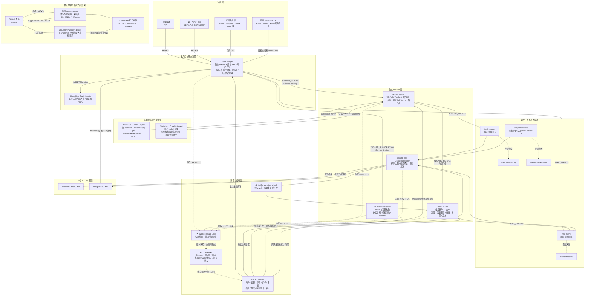

# XBoard CF

XBoard CF 是基于 Cloudflare Workers、D1、KV、Queues、Durable Objects 和 Static Assets 重写的 XBoard。项目保留官方后台 WebUI、用户 API、订阅接口、节点协议、礼品卡、订单分配、邮件和 Telegram 等非支付功能，不需要部署 Laravel、PHP、MySQL 或 Redis。

> 当前仅暂缓需要真实收款、支付回调或资金提现的功能。余额、套餐、流量、邮件和其他非支付业务均使用真实数据处理。

## 主要功能

- 官方 XBoard 后台 WebUI，入口为 `/admin`
- 用户、套餐、权限组、节点、服务器、路由、公告、知识库和工单管理
- 系统设置、订阅设置、订阅模板和邮件模板管理
- Maileroo/Brevo 邮件发送、测试邮件、模板测试、批量用户邮件和提醒邮件队列
- 用户 API 与第三方用户前端兼容接口
- Base64、Clash、Clash Meta、Surge、Shadowrocket、Quantumult X 和 Loon 订阅输出
- UniProxy、ShadowsocksTidalab、TrojanTidalab 和 V2 节点接口
- Xboard-Node 单节点模式、机器模式和 WebSocket 热同步
- 节点在线状态、机器负载、负载历史折线图和网络速率展示
- D1 持久化业务数据，KV 缓存临时状态
- Queue 异步处理流量，Cron Worker 执行周期任务
- 后台联合导入原版 SQLite3 与 Redis RDB，平滑切换到 D1 + KV
- 导出原版兼容 SQLite3，并支持迁移失败后按快照一键还原
- 后台全局搜索仅展示当前可用功能，并可直接打开数据迁移

## 后台入口

站点根路径只返回：

```text
200
```

后台登录页：

```text
https://你的域名/admin
```

后台内部使用 Hash 路由，例如：

```text
/admin#/server/machine
/admin#/server/manage
/admin#/user/manage
```

后台路径可在“系统管理 -> 系统配置 -> 安全设置”中修改。修改后应使用新的安全路径访问后台；菜单中的“数据迁移”和全局搜索结果会自动使用当前路径。

主题配置、插件管理和支付配置当前不兼容 Cloudflare-native 运行时，因此菜单及全局搜索结果均隐藏。对应前端路由、数据库表和兼容代码仍保留，方便未来升级。

### 默认超级管理员

```text
邮箱：admin@admin.com
密码：adminadmin
```

首次登录后请立即修改默认密码。

## Worker 架构

每个 Worker 都是独立部署根目录：

| Worker | 根目录 | 职责 |
| --- | --- | --- |
| `xboard-edge` | `workers/xboard-edge` | 后台 WebUI、后台 API、用户 API、节点接口代理 |
| `xboard-subscription` | `workers/xboard-subscription` | 订阅校验、订阅格式生成和短缓存 |
| `xboard-server` | `workers/xboard-server` | 节点 HTTP、机器模式、状态上报和 WebSocket |
| `xboard-jobs` | `workers/xboard-jobs` | Queue 消费、流量和统计写入、Maileroo/Brevo 邮件发送 |
| `xboard-cron` | `workers/xboard-cron` | 流量重置、过期检查、统计和清理任务 |

Worker 之间没有依赖仓库根目录的共享运行时代码，因此 Cloudflare 可以直接把每个目录设置为独立的构建根目录。

## Cloudflare 资源

以下资源均由首次 GitHub Actions 自动创建或复用：

| 资源 | 名称或绑定 | 用途 |
| --- | --- | --- |
| D1 | `xboard-db` / `XBOARD_DB` | 用户、套餐、节点、订单、设置、流量和统计等正式业务数据 |
| KV | `xboard-kv` / `XBOARD_KV` | Session、验证码、限流、缓存和版本标记 |
| Queue | `traffic-events` | 节点流量异步入库，由 `xboard-jobs` 消费 |
| Queue | `mail-events` | 邮件任务，由 `xboard-jobs` 消费 |
| Queue | `telegram-events` | 预留的 Telegram 异步通知入口，由 `xboard-jobs` 消费 |
| Queue | `traffic-events-dlq` | 流量任务连续失败 5 次后的死信队列 |
| Queue | `mail-events-dlq` | 邮件任务连续失败 5 次后的死信队列 |
| Queue | `telegram-events-dlq` | Telegram 任务连续失败 5 次后的死信队列 |
| Durable Object | `NodeHub` / `NODE_HUB` | 节点和机器 WebSocket 连接、同步事件与休眠连接管理 |
| Durable Object | `StatusHub` / `STATUS_HUB` | 全局节点与机器实时状态、设备状态及 24 小时负载采样 |
| Static Assets | `ASSETS` | `xboard-edge` 托管后台 WebUI、语言包和静态文件 |
| Service Binding | `XBOARD_SERVER` | `xboard-edge`、`xboard-cron` 调用 `xboard-server` |
| Service Binding | `XBOARD_SUBSCRIPTION` | `xboard-edge` 转发订阅请求到 `xboard-subscription` |
| Queue Producer | `TRAFFIC_EVENTS` | `xboard-server` 写入 `traffic-events` |
| Queue Producer | `MAIL_EVENTS` | `xboard-edge`、`xboard-cron` 写入 `mail-events` |
| Cron Trigger | `* * * * *` | `xboard-cron` 每分钟调度周期检查、统计和清理任务 |

五个 Worker 都绑定同一个 D1 和 KV。D1 是正式业务数据的唯一权威来源；KV 只保存可重新生成的短期数据。高频机器心跳不写入 D1，而是进入 `StatusHub`。设置读取使用 Worker 内存、KV 版本快照和 D1 三级缓存，各 Worker 只加载自身需要的设置字段。KV 不可用或超过额度时会直接跳过 KV 并回源 D1，不会因为缓存故障阻断登录、订阅、节点上报或定时任务。



图中实线表示正常请求、内部调用或持久化数据流；虚线表示缓存回源、失败转移或非主路径。五个 Worker 都从同一仓库部署，但构建根目录和 Cloudflare Worker 服务彼此独立。

### 存储与流量写入

- **D1**：用户、套餐、权限组、节点配置、订单、余额、最终流量、统计和系统设置的权威数据。
- **KV**：Session、验证码、限流、版本号和可重建缓存；不是 Redis 数据的逐键永久替代品。
- **NodeHub**：维护节点或机器的 WebSocket 连接及配置、用户热同步。
- **StatusHub**：保存高频在线状态、设备状态、机器心跳和滚动 24 小时负载采样，避免每次心跳写 D1。
- **Queues**：把高频流量、邮件和 Telegram 任务与 HTTP 请求解耦；连续失败超过重试上限后进入对应 DLQ。

流量事件先按稳定 `event_id` 原子认领，重复投递不会重复计费。同一 Queue batch 内会按用户和服务器聚合后再写 D1；只有确实可能超出流量的用户才写入 `v2_traffic_pending_check`，由 Cron 后续检查并删除已处理记录。这些机制用于降低 D1 的行读取和行写入量。

## 邮件服务

邮件不再使用 SMTP，`xboard-edge` 将邮件任务写入 `mail-events`，`xboard-jobs` 根据后台选择通过 Maileroo 或 Brevo 的 HTTPS API 发送。后台“邮件设置”中的字段含义为：

```text
邮件服务商：Maileroo 或 Brevo，默认 Maileroo
发件人名称：邮件中显示的名称
API Key：所选服务商创建的 API Key
发件人地址：已在所选服务商验证的域名邮箱
```

生产环境也可以把 API Key 配置为 `xboard-jobs` 的 Worker Secret，Secret 会覆盖后台保存值：

```bash
cd workers/xboard-jobs
npx wrangler secret put MAILEROO_API_KEY
# 或
npx wrangler secret put BREVO_API_KEY
```

Maileroo 免费层通常为每月 3,000 封，Brevo 免费层通常为每天 300 封，实际额度以服务商最新政策为准。邮件 Queue 使用稳定事件 ID 做幂等处理。

为降低 Cloudflare 免费额度下的 D1/KV 读写压力，新部署默认将节点配置拉取与流量推送间隔设为 300 秒。该值是 Cloudflare 版本有意采用的资源优化默认值，可在后台系统设置中调整；其他新装默认值（例如 1 小时试用时长）继续对齐原版。

## 首次部署与仓库自动部署

最终部署结构是五个 Worker 分别连接同一个 GitHub 仓库，由 Cloudflare Workers Builds 监听 `master`。每个 Worker 使用自己的根目录，后续 push 不依赖 GitHub Actions 执行 `wrangler deploy`。

开始前必须先让 Cloudflare 账号与 GitHub 账号建立授权关系。打开官方 [Cloudflare Workers & Pages GitHub App](https://github.com/apps/cloudflare-workers-and-pages)，选择 `Install` 或 `Configure`，授权当前 GitHub 账号，并允许它访问准备部署 XBoard 的仓库。Cloudflare 之后才能读取仓库并监听 push。

1. 打开 [Cloudflare API Tokens](https://dash.cloudflare.com/profile/api-tokens)，以 `Edit Cloudflare Workers` 模板创建 API Token，并补充 D1、Workers KV Storage 和 Queues 的编辑权限。新 Cloudflare 账号还应至少打开一次 [Workers & Pages](https://dash.cloudflare.com/?to=/:account/workers-and-pages)，让 Cloudflare 初始化账号的 `workers.dev` 子域名。

   

2. Fork 本仓库到自己的 GitHub 账号，或使用本仓库作为部署源。部署仓库必须包含完整项目，并保留五个 `workers/xboard-*` 目录；生产分支使用 `master`。

   

3. 在部署仓库进入 `Settings -> Secrets and variables -> Actions`，新建名为 `CLOUDFLARE_API_TOKEN` 的 Repository secret，值为第一步创建的 Token。Token 由 GitHub Secrets 保存，不要写入代码或公开日志。

   

首次部署使用仓库内只允许手动触发的 `.github/workflows/deploy.yml`：

```text
CLOUDFLARE_API_TOKEN
```

然后打开 `Actions -> Bootstrap XBoard on Cloudflare -> Run workflow`。workflow 会自动识别 Token 所属账号，创建或复用 `xboard-db`、`xboard-kv`、三个业务 Queue 及对应的三个死信队列，把当前账号、D1 和 KV 的资源 ID 写入五个 Worker 的 `wrangler.toml`，使用 GitHub 自动提供的 `GITHUB_TOKEN` 提交回当前分支，再自动执行 D1 schema 与 seed，创建 Durable Objects、Cron Trigger、Static Assets 和 Service Bindings，并按依赖顺序创建或更新五个 Worker。它只配置了 `workflow_dispatch`，不会在每次 push 时运行。

资源 ID 不是 API Token 或数据库密码，必须随部署仓库保存，Cloudflare Workers Builds 后续检出代码时才能继续绑定同一套资源。workflow 只提交五个 `workers/xboard-*/wrangler.toml`，不会提交 `CLOUDFLARE_API_TOKEN`。如果仓库禁止 GitHub Actions 写入内容，或 `master` 分支保护规则禁止 workflow 直接推送，首次部署会在“Persist Cloudflare resource bindings”步骤明确失败；请允许该 workflow 写入仓库后重新手动运行。

API Token 至少需要该账号下 Workers Scripts、D1、Workers KV Storage、Queues 和 Account Settings 的读取/编辑权限。若 Token 可访问多个账号，workflow 使用 Cloudflare API 返回的第一个账号。

### 必须完成的一次 GitHub 授权

前置步骤中的 GitHub App 授权必须在配置 Builds 前完成。`CLOUDFLARE_API_TOKEN` 只能操作 Cloudflare 账号，不能替 GitHub 仓库所有者批准仓库访问；Cloudflare 目前也没有公开的 Wrangler 命令或 REST API 用于创建 Workers Builds 的 Git 仓库连接。这是 GitHub 的安全授权边界，workflow 无法绕过。

授权完成后，在 Cloudflare 中依次打开每个已创建的 Worker，进入 `Settings -> Builds -> Connect`，五个 Worker 都选择：

```text
仓库：kemi-20/Xboard-cf
生产分支：master
构建命令：npm ci && npm run typecheck && npm test
部署命令：npx wrangler deploy
```

分别设置根目录：

```text
workers/xboard-edge
workers/xboard-subscription
workers/xboard-server
workers/xboard-jobs
workers/xboard-cron
```

workflow 的运行摘要会生成五个 Worker 的 Builds 设置直达链接和对应根目录，方便逐项连接。连接完成后，推送 `master` 会由 Cloudflare Workers Builds 自动构建和部署对应 Worker；GitHub Actions 只负责首次创建资源和 Worker，不负责后续 push 部署。

Cloudflare 官方说明：[Workers Builds](https://developers.cloudflare.com/workers/ci-cd/builds/) 和 [GitHub integration](https://developers.cloudflare.com/workers/ci-cd/builds/git-integration/github-integration/)。

## 从原版迁移

登录后台后打开“系统管理 -> 数据迁移”，也可以在顶部全局搜索中搜索“数据迁移”，或直接打开：

```text
https://你的域名/admin/migration
```

如果修改过后台路径，请把 `admin` 换成实际路径。SQLite3 是必选的正式业务数据库；Redis 是可选的运行状态备份：

```text
xboard.db   SQLite3 正式业务数据（必选）
dump.rdb    Redis 运行状态（可选，也支持规范化 Redis JSON）
```

浏览器会在本地解析所选文件，不会把整个数据库文件上传到第三方。SQLite 数据按最多 100 行一批写入 D1；选择 Redis 时，只迁移节点心跳、推送时间、在线人数、负载、Metrics、待检查流量用户和旧调度时间。未选择 Redis 不影响用户、套餐、节点配置、订单、设置和历史统计等核心业务数据；节点重新连接后会重新生成在线状态和负载。以下瞬时数据始终会自动跳过：

```text
Laravel Horizon 和旧 Queue 任务
framework/schedule 锁
旧 Session、临时登录 Token
邮箱验证码、密码错误次数和注册限流计数
```

第 2 步“数据预检”会明确列出无法自动切换的外部服务配置。原版 SMTP/邮件驱动设置、任何邮件服务商凭据、所有插件、插件配置和支付渠道都不会导入或导出；迁移完成后必须在新后台选择 Maileroo 或 Brevo，并手动填写 API Key、发件人邮箱和发件人名称。Telegram 机器人由 Worker 内置实现，不依赖原版插件。所有旧主题和主题配置也会忽略，迁移后固定使用内置 `Xboard` 默认主题。邮件模板、订单等可审计业务历史仍会保留，但真实支付能力不会因此启用。

默认“完整切换”会以原版主键数据为准，以保持用户、套餐、权限组、节点、机器、订单和统计之间的 ID 关系。“合并”只补充 D1 不存在的数据，适合已有 Cloudflare 数据时谨慎使用。迁移过程中即使原版设置覆盖了后台路径和访问令牌，迁移任务也会使用一次性迁移凭据继续执行；任务完成后该凭据立即失效。

点击开始迁移后，浏览器默认会先把当前 D1 数据导出为原版兼容的 `xboard-pre-migration-*.db`，下载完成并校验快照行数后才会清理或写入目标数据。迁移源区域提供“跳过完整迁移前备份”选项；启用后仍会强制备份 `v2_user` 和 `personal_access_tokens`，并优先迁移这两张表，但其他业务表不会建立回滚快照，失败时不能一键完整还原。预检仍会显示 `v2_log` 和 `v2_server_machine_load_history` 的源库行数并标记 `(skip)`，但它们不计入迁移进度，也不参与备份、导入或导出；迁移完成后旧运行状态会被清空，节点后续上报会在 `StatusHub` 中重新建立实时状态和 24 小时负载历史。迁移页面还提供“导出当前数据”按钮，可随时生成标准 SQLite3 `xboard-export-*.db`；导出的邮件凭据为空，插件、插件配置和支付配置不导出。

任一批次失败时迁移会立即中止，进度和详细错误以红色显示。只要迁移前快照已经完成，页面会显示“一键还原”，用于清理本次失败写入并恢复迁移前的 D1 数据和本次修改过的 KV 键。

真实备份预演覆盖 14,369 行 SQLite 数据和 Redis 12 格式 RDB。迁移器会处理原版与 D1 的字段差异，包括时间戳、`transfer_used_total`、机器启用状态、订阅模板默认字段和 bcrypt 密码标记。

## 本地检查

检查所有 Worker：

```bash
npm install
npm run typecheck
npm test
```

检查单个 Worker：

```bash
cd workers/xboard-edge
npm install
npm run typecheck
npm test
npx wrangler deploy --dry-run --outdir ../../.tmp/xboard-edge-dry-run
```

所有临时脚本、上游仓库和 dry-run 产物应放在 `.tmp/`，不得提交。

## 兼容基线

节点 HTTP、机器模式和 WebSocket 协议固定以以下提交为兼容基线：

```text
cedar2025/Xboard       8e4864b4c7f6240e3ef08ecd7b59447e5d9dd363
cedar2025/Xboard-Node  0a29338e1f102a462363ce3527417029f89bab28
```

Cloudflare 内部可以使用 D1、KV、Queues 和 Durable Objects 替代 Laravel、SQLite/Redis Queue 等组件，但节点可观察到的路由、认证、字段、状态码、ETag、304 和 WebSocket 事件应保持兼容。项目测试覆盖后台主要响应结构、订阅格式、节点协议、Queue 幂等、缓存降级和 Cron 行为；正式升级前仍建议使用实际域名、真实节点和常用订阅客户端做一次端到端检查。

## 更新与排错

正常更新只需 push 到已连接的生产分支。Cloudflare Workers Builds 会分别在五个根目录执行测试和部署；无需再次运行首次部署 Action。

遇到部署或运行问题时优先检查：

1. 五个 Worker 最近一次 Build 是否成功，根目录是否各自正确。
2. `xboard-edge` 的 `XBOARD_SERVER`、`XBOARD_SUBSCRIPTION` 和 `ASSETS` 绑定是否存在。
3. `xboard-server` 的 `NODE_HUB`、`STATUS_HUB` 和 `TRAFFIC_EVENTS` 是否存在。
4. `xboard-jobs` 是否绑定三个业务 Queue 及其 DLQ。
5. D1 和 KV ID 是否仍与首次部署 Action 写入的 `wrangler.toml` 一致。
6. 修改系统设置后短暂等待缓存版本传播；KV 故障时系统应自动回源 D1。

## 暂未启用的功能

以下功能暂不进行真实业务处理：

- 在线支付和支付回调
- 需要真实出金的佣金提现
- 依赖外部支付插件的订单流程

Cloudflare Workers 无法在运行时解压并执行 Laravel Blade 主题或任意 PHP 插件。主题配置、插件管理和支付配置目前在菜单和全局搜索中隐藏，相关路由、表结构和兼容代码仍保留，便于未来升级为 Cloudflare-native 实现；上传 PHP/Blade ZIP 包不会被执行。Telegram 机器人是内置功能，不需要安装插件。

支付相关表和兼容接口仍然保留，用于避免后台页面崩溃。

## 上游项目与许可

本项目参考以下 cedar2025/XBoard 生态仓库：

- https://github.com/cedar2025/Xboard
- https://github.com/cedar2025/xboard-admin-dist
- https://github.com/cedar2025/xboard-user
- https://github.com/cedar2025/Xboard-Node

后台静态资源来自 `xboard-admin-dist`，节点协议以固定提交版本为兼容基线。原项目使用 MIT License，复制或修改上游代码和资源时请保留原作者归属与许可说明。
